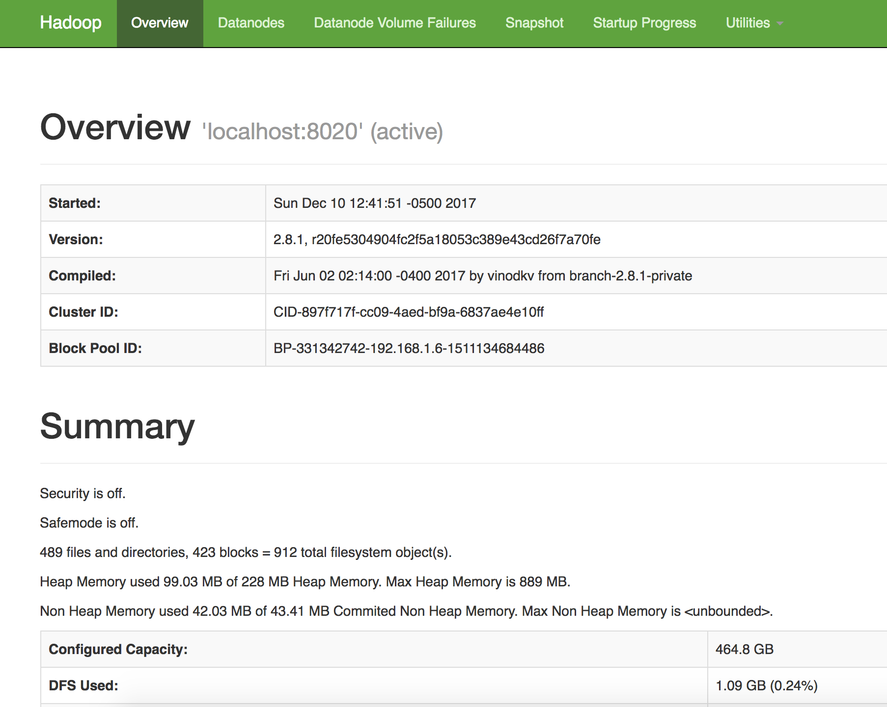

```{r setup, include=FALSE}
knitr::opts_chunk$set(cache=TRUE)
```

<center>{ width=85%}</center>
<br>

# Introduction
**The goal of the project** is to execute data science exploration steps against flights data  and create a regression model to predict what flight will be delayed

The data consists of flight arrival and departure details for all commercial flights within the USA, from October 1987 to April 2008.  

For my analysis I will be using  data for 2007-2008 years only. Data for 2007 will be splitted into training and validation sets, data for 2008 will serve as validation set to evaluate the model performance

# Batch Ingestion & Processing 

 The first step is to set up Big Data environemnt using the following technology stack - HDFS, YARN, Apache Spark, Apache kafka and Apache Flume
 
## Big Data local environment (Mac OS) {.tabset}

### HDFS
Start Hadoop standalone cluster 

```{bash eval=FALSE, include=TRUE}
cd /usr/local/Cellar/hadoop/2.8.1/
./sbin/start-dfs.sh 
```
<center>{ width=60%}</center>

### YARN
Start YARN manager
```{bash eval=FALSE, include=TRUE}
./sbin/start-yarn.sh
```
<center>{ width=100%}</center>

### Apache Spark
Start Spark cluster with 2 workers
```{bash eval=FALSE, include=TRUE}
cd /Users/olegbaydakov/Downloads/spark-2.2.0-bin-hadoop2.7
./sbin/start-master.sh -i $SPARK_LOCAL_IP 
./sbin/start-slave.sh spark://$SPARK_LOCAL_IP:7077
```
{ width=100%}

### Kafka and Zookeper
Start zookeper server
```{bash eval=FALSE, include=TRUE}
bin/zookeeper-server-start.sh config/zookeeper.properties
```
Start Apache Kafka cluser consisting from 3 instances
```{bash eval=FALSE, include=TRUE}
bin/kafka-server-start.sh config/server.properties
bin/kafka-server-start.sh config/server-1.properties
bin/kafka-server-start.sh config/server-2.properties
```


## Data preparation
### Create Kafka topics
```{bash eval=FALSE, include=TRUE}
sh kafka-topics --create --zookeeper localhost:2181 --replication-factor 2 --partitions 2 --topic airports

sh kafka-topics --create --zookeeper localhost:2181 --replication-factor 2 --partitions 2 --topic planedate

sh kafka-topics --create --zookeeper localhost:2181 --replication-factor 2 --partitions 2 --topic carriers

sh kafka-topics --list --zookeeper localhost:2181
```

### Download data
Run the following script to download data from the web onto local folder. Download the yearly flight data and the airlines lookup table. 
```{bash eval=FALSE, include=TRUE}
# Make download directory
mkdir /tmp/flights

# Download flight data by year
for i in {1987..2008}
  do
    echo "$(date) $i Download"
    fnam=$i.csv.bz2
    wget -O /tmp/flights/$fnam http://stat-computing.org/dataexpo/2009/$fnam
    echo "$(date) $i Unzip"
    bunzip2 /tmp/flights/$fnam
  done

# Download airline carrier data
wget -O /tmp/airlines.csv http://www.transtats.bts.gov/Download_Lookup.asp?Lookup=L_UNIQUE_CARRIERS

# Download airports data
wget -O /tmp/airports.csv https://raw.githubusercontent.com/jpatokal/openflights/master/data/airports.dat

```
{ width=100%}

### Submit data to Kafka topics
```{bash eval=FALSE, include=TRUE}
// kafka producer
bin/kafka-console-producer.sh --broker-list localhost:9092 --topic planedate < ~/tmp/2008.csv
bin/kafka-console-producer.sh --broker-list localhost:9092 --topic airports < ~/tmp/airports.csv
bin/kafka-console-producer.sh --broker-list localhost:9092 --topic carriers < ~/tmp/airlines.csv
```

## Batch ingestion (HDFS)
### Create folders in HDFS:
```{bash eval=FALSE, include=TRUE}
hadoop fs -mkdir /data/raw
hadoop fs -mkdir /data/modelled
hadoop fs -mkdir /data/decomposed

hadoop fs -mkdir /data/raw/airports
hadoop fs -mkdir /data/raw/airlines
hadoop fs -mkdir /data/raw/flights

hadoop fs -mkdir /data/decomposed/airports
hadoop fs -mkdir /data/decomposed/airlines
hadoop fs -mkdir /data/decomposed/flights

hadoop fs -mkdir /data/modelled/airports
hadoop fs -mkdir /data/modelled/airlines
hadoop fs -mkdir /data/modelled/flights

```

### Flume configuration {.tabset}
Create Flume configuration files for airports and planedate topcis to be ingested into HDFS (raw zone)

#### Airports
```{bash eval=FALSE, include=TRUE}
a1.sources.r1.zookeeperConnect=localhost:2181
a1.sources.r1.topic=airports

a1.sinks.k1.type = hdfs
a1.sinks.k1.hdfs.writeFormat=Text
a1.sinks.k1.hdfs.fileType=DataStream
a1.sinks.k1.hdfs.path=/data/raw/airports/
a1.sinks.k1.hdfs.filePrefix=airports
a1.sinks.k1.hdfs.rollCount=100000
a1.sinks.k1.hdfs.rollSize=0

# Use a channel which buffers events in memory
a1.channels.c1.type = memory
a1.channels.c1.capacity = 10000
a1.channels.c1.transactionCapacity = 10000

# Bind the source and sink to the channel
a1.sources.r1.channels = c1
a1.sinks.k1.channel = c1
```
#### Planedate
```{bash eval=FALSE, include=TRUE}
# Name the components on this agent
a1.sources = r1
a1.sinks = k1
a1.channels = c1

a1.sources.r1.type=org.apache.flume.source.kafka.KafkaSource
a1.sources.r1.zookeeperConnect=localhost:2181
a1.sources.r1.topic=planedate

a1.sinks.k1.type = hdfs
a1.sinks.k1.hdfs.writeFormat=Text
a1.sinks.k1.hdfs.fileType=DataStream
a1.sinks.k1.hdfs.path=/data/raw/planedate/
a1.sinks.k1.hdfs.filePrefix=planedate
a1.sinks.k1.hdfs.rollCount=10000000
a1.sinks.k1.hdfs.rollSize=0

# Use a channel which buffers events in memory
a1.channels.c1.type = memory
a1.channels.c1.capacity = 10000
a1.channels.c1.transactionCapacity = 10000

# Bind the source and sink to the channel
a1.sources.r1.channels = c1
a1.sinks.k1.channel = c1
```

#### Flume agents
```{bash eval=FALSE, include=TRUE}
sh flume-ng agent --conf conf --conf-file airports.conf --name a1 -Dflume.root.logger=INFO,console

sh flume-ng agent --conf conf --conf-file planedate.conf --name a1 -Dflume.root.logger=INFO,console
```


### Kafka and Spark structured streaming integration {.tabset}
Scala code to read data from Kafka topic using Spark structured streaming

+ Scala trait to initialize Spark

+ Main object to pull data from Kafaka topic and ingest into HDFS

#### SparkInit.scala
```{python eval=FALSE, include=TRUE}
package kafka_stream

import org.apache.hadoop.yarn.util.RackResolver
import org.apache.log4j.{Level, LogManager, Logger}
import org.apache.spark.sql.SparkSession

trait InitSpark {
  Logger.getLogger(classOf[RackResolver]).getLevel
  Logger.getLogger("org").setLevel(Level.OFF)
  Logger.getLogger("akka").setLevel(Level.OFF)

  val spark: SparkSession = SparkSession.builder()
    .appName("Spark Structured Streaming Example")
    //.master("local[*]")
    .master("spark://127.0.01:7077")
    .getOrCreate()

  val sc = spark.sparkContext
  val sqlContext = spark.sqlContext

  def reader = spark.read
    .option("header",true)
    .option("inferSchema", false)
    .option("mode", "DROPMALFORMED")
    .option("dateFormat", "dd/MM/yyyy")

  def readerWithoutHeader = spark.read
    .option("header",true)
    .option("inferSchema", false)
    .option("mode", "DROPMALFORMED")
    .option("dateFormat", "MM/dd/yyyy")


  def close = {
    spark.close()
  }
}
```
#### KafkaStream.scala
```{python eval=FALSE, include=TRUE}
package kafka_stream

import org.apache.hadoop.yarn.util.RackResolver
import org.apache.spark.sql.{Dataset, SaveMode, SparkSession}
import org.apache.spark.sql.streaming.{OutputMode, ProcessingTime}

import org.apache.spark.streaming.kafka.KafkaUtils
import kafka.serializer.StringDecoder

import org.apache.spark.streaming._

import org.apache.spark.streaming.Durations
import org.apache.log4j.{Level, Logger}

object kafka_stream extends InitSpark {

  import spark.implicits._

  def main(args: Array[String]): Unit = {

    Logger.getLogger(classOf[RackResolver]).getLevel
    Logger.getLogger("org").setLevel(Level.OFF)
    Logger.getLogger("akka").setLevel(Level.OFF)
    
    read_from_kafka()
    }

 def read_from_kafka():Unit ={
    import spark.implicits._
   
   // READ FROM KAFKA TOPIC
    val df = spark
      .readStream
      .format("kafka")
      .option("kafka.bootstrap.servers", "localhost:9092")
      .option("subscribe", "carriers")
      .option("startingOffsets", "earliest")
      .option("failOnDataLoss", "false")
      .load()

    val values = df.selectExpr("CAST(value AS STRING)").as[String]
    
   // WRITE TO HDFS
   val query = values //.orderBy("window")
      .repartition(1)
      .writeStream
      .outputMode(OutputMode.Append())
      .format("csv")
      .option("checkpointLocation", "hdfs://localhost:8020/tmp/checkpoints")
      .option("path", "hdfs://localhost:8020/data/raw/carriers")
      .start()
      .awaitTermination()
 }
}

```
#### build.sbt
```{python eval=FALSE, include=TRUE}
name := "KafakSpark"

version := "1.0"

scalaVersion := "2.11.8"

libraryDependencies ++= Seq(
  "org.apache.spark" % "spark-core_2.11" % "2.2.0" ,
  "org.apache.spark" % "spark-sql_2.11" % "2.2.0" ,
  "org.apache.spark" % "spark-streaming_2.11" % "2.2.0",
  "org.apache.spark" % "spark-streaming-kafka_2.11" % "1.6.3"
)

// https://mvnrepository.com/artifact/org.apache.kafka/kafka_2.11
libraryDependencies += "org.apache.kafka" % "kafka_2.11" % "0.11.0.0"

// https://mvnrepository.com/artifact/org.apache.kafka/kafka-clients
libraryDependencies += "org.apache.kafka" % "kafka-clients" % "0.11.0.0"

// https://mvnrepository.com/artifact/org.apache.kafka/kafka-streams
libraryDependencies += "org.apache.kafka" % "kafka-streams" % "0.11.0.0"

// https://mvnrepository.com/artifact/org.apache.kafka/connect-api
libraryDependencies += "org.apache.kafka" % "connect-api" % "0.11.0.0"

libraryDependencies += "com.databricks" %% "spark-avro" % "4.0.0"

resolvers += Resolver.mavenLocal
resolvers += "central maven" at "https://repo1.maven.org/maven2/"
```

## Batch processing  raw -> decomposed -> modelled (HDFS)
Create external Hive tables in every HDFS zone.

### Raw zone  {.tabset}

#### Airports
```{sql eval=FALSE,  include=TRUE}
CREATE EXTERNAL TABLE IF NOT EXISTS airports(
iata STRING,
airport STRING,
city STRING,
state STRING,
country STRING,
lat STRING,
longt STRING)
ROW FORMAT DELIMITED
    FIELDS TERMINATED BY ','
    STORED AS TEXTFILE
    LOCATION '/data/raw/airports'
   tblproperties ("skip.header.line.count"="1") 
    ;

```
#### Carriers (airlines)
```{sql eval=FALSE,  include=TRUE}
CREATE EXTERNAL TABLE IF NOT EXISTS airlines
(
Code string,
Description string
)
ROW FORMAT SERDE 'org.apache.hadoop.hive.serde2.OpenCSVSerde'
WITH SERDEPROPERTIES
(
"separatorChar" = '\,',
"quoteChar"     = '\"'
)
STORED AS TEXTFILE
 LOCATION '/data/raw/carriers'
tblproperties("skip.header.line.count"="1");
```
#### Planedate (flights) 
```{sql eval=FALSE,  include=TRUE}
drop table if exists flights;
CREATE EXTERNAL TABLE IF NOT EXISTS flights(
 year STRING,
 month STRING,
 dayofmonth STRING,
 dayofweek STRING,
 deptime STRING,
 crsdeptime STRING,
 arrtime STRING,
 crsarrtime STRING,
 uniquecarrier STRING,
 flightnum STRING,
 tailnum STRING,
 actualelapsedtime STRING,
 crselapsedtime STRING,
 airtime STRING,
 arrdelay STRING,
 depdelay STRING,
 origin STRING,
 dest STRING,
 distance STRING,
 taxiin STRING,
 taxiout STRING,
 cancelled STRING,
 cancellationcode STRING,
 diverted STRING,
 carrierdelay STRING,
 weatherdelay STRING,
 nasdelay STRING,
 securitydelay STRING,
 lateaircraftdelay STRING)
ROW FORMAT DELIMITED
    FIELDS TERMINATED BY ','
    STORED AS TEXTFILE
    LOCATION '/data/raw/planedate'
   tblproperties ("skip.header.line.count"="1") 
    ;
```

### Decomposed zone  {.tabset}

I used Hive SQl to add additional columns and convert Hive tables from CSV to Avro since Apache Pig is pretty slow and in my opinion it's  pretty outdated for using in production.

#### Airports
```{sql eval=FALSE,  include=TRUE}
use decomposed;
drop table if exists airports;
CREATE EXTERNAL TABLE IF NOT EXISTS airports(
iata STRING,
airport STRING,
city STRING,
state STRING,
country STRING,
lat STRING,
longt STRING,
 insert_time timestamp,
 uuid string
)
 STORED AS AVRO
    LOCATION '/data/decomposed/airports';

 use decomposed;
INSERT OVERWRITE TABLE airports SELECT 
REGEXP_REPLACE(airport,'"',''),REGEXP_REPLACE(airport,'"',''),REGEXP_REPLACE(city,'"',''),
REGEXP_REPLACE(state,'"',''),REGEXP_REPLACE(country,'"','') ,lat,long as longt  , CURRENT_TIMESTAMP AS insert_time, 
reflect("java.util.UUID", "randomUUID") as uuid FROM default.airports;
```

#### Carriers(airlines)
```{sql eval=FALSE,  include=TRUE}
use decomposed;
drop table if exists airlines;
CREATE EXTERNAL TABLE IF NOT EXISTS airlines(
    Code STRING, Description STRING,
    insert_time timestamp,
    uuid string
   )
    STORED AS AVRO
    LOCATION '/data/decomposed/carriers';

use decomposed;
INSERT OVERWRITE TABLE airlines SELECT * , CURRENT_TIMESTAMP AS insert_time, 
reflect("java.util.UUID", "randomUUID") as uuid FROM default.airlines;
```
#### Planedate(flights)
```{sql eval=FALSE,  include=TRUE}
use decomposed;
drop table if exists flights;
CREATE EXTERNAL TABLE IF NOT EXISTS flights(
 year STRING,
 month STRING,
 dayofmonth STRING,
 dayofweek STRING,
 deptime STRING,
 crsdeptime STRING,
 arrtime STRING,
 crsarrtime STRING,
 uniquecarrier STRING,
 flightnum STRING,
 tailnum STRING,
 actualelapsedtime STRING,
 crselapsedtime STRING,
 airtime STRING,
 arrdelay STRING,
 depdelay STRING,
 origin STRING,
 dest STRING,
 distance STRING,
 taxiin STRING,
 taxiout STRING,
 cancelled STRING,
 cancellationcode STRING,
 diverted STRING,
 carrierdelay STRING,
 weatherdelay STRING,
 nasdelay STRING,
 securitydelay STRING,
 lateaircraftdelay STRING,
 insert_time timestamp,
 uuid string)   
STORED AS AVRO
    LOCATION '/data/decomposed/planedate';

use decomposed;
INSERT OVERWRITE TABLE flights SELECT * , CURRENT_TIMESTAMP AS insert_time, 
reflect("java.util.UUID", "randomUUID") as uuid FROM default.flights;
```
### Modelled zone  {.tabset}

Hive SQL scripts to create external tables Parquet format

#### Airports
```{sql eval=FALSE,  include=TRUE}
use modelled;
drop table if exists airports;
CREATE EXTERNAL TABLE IF NOT EXISTS airports(
id string,
name string,
city string,
country string,
faa string,
icao string,
lat double,
lon double,
alt int,
tz_offset double,
dst string,
tz_name string
)
 STORED AS PARQUET
    LOCATION '/data/modelled/airports';
```

#### Carriers(airlines)
```{sql eval=FALSE,  include=TRUE}
use modelled;
drop table if exists airlines;
CREATE EXTERNAL TABLE IF NOT EXISTS airlines(
    Code STRING, Description STRING,
    insert_time timestamp,
    uuid string
   )
    STORED AS PARQUET
    LOCATION '/data/modelled/carriers';
```
#### Planedate(flights)
```{sql eval=FALSE,  include=TRUE}
use modelled;
drop table if exists flights;
CREATE EXTERNAL TABLE IF NOT EXISTS flights(
 year int,
month int,
dayofmonth int,
dayofweek int,
deptime int,
crsdeptime int,
arrtime int, 
crsarrtime int,
uniquecarrier string,
flightnum int,
tailnum string, 
actualelapsedtime int,
crselapsedtime int,
airtime string,
arrdelay int,
depdelay int, 
origin string,
dest string,
distance int,
taxiin string,
taxiout string,
cancelled int,
cancellationcode string,
diverted int,
carrierdelay string,
weatherdelay string,
nasdelay string,
securitydelay string,
lateaircraftdelay string
)   
STORED AS PARQUET
    LOCATION '/data/modelled/planedate';

```

### Data transfer from decomposed to modelled zone

#### Hive SQL example
```{sql eval=FALSE,  include=TRUE}
use modelled;
INSERT OVERWRITE TABLE flights  SELECT *  FROM modelled.flights;
```
#### Spark example (scala code)
Read avro file to Spark Data Frame based on Scala case classes and then save it to parquet file

```{python eval=FALSE,  include=TRUE}
case class airports(iata:String,	airport:String,	city:String,	state:String,	country:String,lat:String,	longt:String, insert_time:String, uuid:String)

case class carriers(code:String,	description:String, insert_time:String, uuid:String )

case class planedate(year: String, month : String, dayofmonth : String, dayofweek : String, deptime : String, crsdeptime : String, arrtime : String, crsarrtime : String, uniquecarrier : String,flightnum : String, tailnum : String, actualelapsedtime : String, crselapsedtime : String, airtime : String, arrdelay : String, depdelay : String, origin : String, dest : String, distance : String, taxiin : String, taxiout : String, cancelled : String, cancellationcode : String,
 diverted : String, carrierdelay : String, weatherdelay : String, nasdelay : String, securitydelay : String, lateAircraftdelay : String, insert_time: String, uuid : String )
 
import org.apache.spark.sql.functions._
import com.databricks.spark.avro._
import org.apache.spark.sql.SparkSession

val spark = SparkSession.builder()
                         .master("spark://127.0.01:7077")
                        .getOrCreate()

// The Avro records get converted to Spark types and
// then written back out as Parquet records
val df_planedate_decomposed = spark.read
              .avro("hdfs://localhost:8020/data/decomposed/planedate/")           
              .as[planedate]
              
val df_airports_decomposed = spark.read
              .avro("hdfs://localhost:8020/data/decomposed/airports/")           
              .as[planedate]

 df_planedate_decomposed.registerTempTable("planedate_DF") 
 
  //What are the primary causes for flight delays
    spark.sql("SELECT sum(weatherDelay) Weather,sum(nasdelay) NAS, sum(securitydelay) Security, sum(lateaircraftdelay) lateAircraft, sum(carrierdelay) Carrier FROM planedate_DF ").show()

    // Which Airports have the Most Delays

    spark.sql("SELECT origin, count(*) conFlight, avg(depdelay) delay FROM planedate_DF GROUP BY origin")
      .sort(desc("delay")).show()

    // Join airports and flights data
    df_planedate_decomposed.join(df_airports_decomposed, $"origin" === $"iata", joinType="inner").show(5)
 
    // Write to Parquet file to modelled zone
     df_planedate_decomposed.write.parquet("hdfs://localhost:8020/data/modelled/planedate/")
     df_airports_decomposed .write.parquet("hdfs://localhost:8020/data/modelled/airports/")
     
    
```

# Data Analysis
This analysis predicts time gained in flight by airline carrier using integration between R and Spark

```{r}
library(rsparkling)
library(sparklyr)
library(dplyr)
```


```{r eval=FALSE,  include=TRUE}

config=spark_config()
sc <- spark_connect(master = "yarn-client", 
                    version = "2.2.0",
                    app_name = "sparklyr4",
                    spark_home = "/Users/olegbaydakov/Downloads/spark-2.2.0-bin-hadoop2.7/",
                    config = config)

```

## Cache the tables into memory

Use tbl_cache to load the flights table into memory. Caching tables will make analysis much faster. Create a dplyr reference to the Spark DataFrame.
```{r eval=FALSE,  include=TRUE}
# Cache flights Hive table into Spark
tbl_cache(sc, 'flights')
flights_tbl <- tbl(sc, 'flights')

# Cache airlines Hive table into Spark
tbl_cache(sc, 'airlines')
airlines_tbl <- tbl(sc, 'airlines')

# Cache airports Hive table into Spark
tbl_cache(sc, 'airports')
airports_tbl <- tbl(sc, 'airports')


```

## Create a model data set

Filter the data to contain only the records to be used in the fitted model. Join carrier descriptions for reference. Create a new variable called gain which represents the amount of time gained (or lost) in flight.
```{r eval=FALSE,  include=TRUE}
library(dplyr)
# Filter records and create target variable 'gain'
model_data <- flights_tbl %>%
  filter(!is.na(arrdelay) & !is.na(depdelay) & !is.na(distance)) %>%
  filter(depdelay > 15 & depdelay < 240) %>%
  filter(arrdelay > -60 & arrdelay < 360) %>%
  filter(year >= 2003 & year <= 2007) %>%
  left_join(airlines_tbl, by = c("uniquecarrier" = "code")) %>%
  mutate(gain = depdelay - arrdelay) %>%
  select(year, month, arrdelay, depdelay, distance, uniquecarrier, description, gain)

# Summarize data by carrier
model_data %>%
  group_by(uniquecarrier) %>%
  summarize(description = min(description), gain=mean(gain), 
            distance=mean(distance), depdelay=mean(depdelay)) %>%
  select(description, gain, distance, depdelay) %>%
  arrange(gain)
```
<center>{ width=100%}</center>

## Train a linear model

Predict time gained or lost in flight as a function of distance, departure delay, and airline carrier.
```{r eval=FALSE,  include=TRUE}
# Partition the data into training and validation sets
model_partition <- model_data %>% 
  sdf_partition(train = 0.8, valid = 0.2, seed = 5555)

# Fit a linear model
ml1 <- model_partition$train %>%
  ml_linear_regression(gain ~ distance + depdelay + uniquecarrier)

# Summarize the linear model
summary(ml1)
```

<center>{ width=100%}</center>

</br>

## Assess model performance

Compare the model performance using the validation data.
```{r eval=FALSE,  include=TRUE}
# Calculate average gains by predicted decile
model_deciles <- lapply(model_partition, function(x) {
  sdf_predict(ml1, x) %>%
    mutate(decile = ntile(desc(prediction), 10)) %>%
    group_by(decile) %>%
    summarize(gain = mean(gain)) %>%
    select(decile, gain) %>%
    collect()
})

# Create a summary dataset for plotting
deciles <- rbind(
  data.frame(data = 'train', model_deciles$train),
  data.frame(data = 'valid', model_deciles$valid),
  make.row.names = FALSE
)

# Plot average gains by predicted decile
deciles %>%
  ggplot(aes(factor(decile), gain, fill = data)) +
  geom_bar(stat = 'identity', position = 'dodge') +
  labs(title = 'Average gain by predicted decile', x = 'Decile', y = 'Minutes')
```
<center>{ width=100%}</center>

## Visualize predictions

Compare actual gains to predicted gains for an out of time sample.
```{r eval=FALSE,  include=TRUE}
# Select data from an out of time sample
data_2008 <- flights_tbl %>%
  filter(!is.na(arrdelay) & !is.na(depdelay) & !is.na(distance)) %>%
  filter(depdelay > 15 & depdelay < 240) %>%
  filter(arrdelay > -60 & arrdelay < 360) %>%
  filter(year == 2008) %>%
  left_join(airlines_tbl, by = c("uniquecarrier" = "code")) %>%
  mutate(gain = depdelay - arrdelay) %>%
  select(year, month, arrdelay, depdelay, distance, uniquecarrier, description, gain, origin,dest)

# Summarize data by carrier
carrier <- sdf_predict(ml1, data_2008) %>%
  group_by(description) %>%
  summarize(gain = mean(gain), prediction = mean(prediction), freq = n()) %>%
  filter(freq > 10000) %>%
  collect

# Plot actual gains and predicted gains by airline carrier
p <- ggplot(carrier, aes(gain, prediction)) + 
  geom_point(alpha = 0.75, color = 'red', shape = 3) +
  geom_abline(intercept = 0, slope = 1, alpha = 0.15, color = 'blue') +
  geom_text(aes(label = substr(description, 1, 20)), size = 3, alpha = 0.75, vjust = -1) +
  labs(title='Average Gains Forecast', x = 'Actual', y = 'Predicted')
p
```
<center>{ width=100%}</center>


Some carriers make up more time than others in flight, but the differences are relatively small. The average time gains between the best and worst airlines is only six minutes. The best predictor of time gained is not carrier but flight distance. The biggest gains were associated with the longest flights.

## Share Insights - deploy model to production

### Build dashboard

Aggregate the scored data by origin, destination, and airline. Save the aggregated data.
```{r eval=FALSE,  include=TRUE}
setwd("~/Documents/airlines_dubai")
# Summarize by origin, destination, and carrier
summary_2008 <- sdf_predict(ml1, data_2008) %>%
  rename(carrier = uniquecarrier, airline = description) %>%
  group_by(origin, dest, carrier, airline) %>%
  summarize(
    flights = n(),
    distance = mean(distance),
    avg_dep_delay = mean(depdelay),
    avg_arr_delay = mean(arrdelay),
    avg_gain = mean(gain),
    pred_gain = mean(prediction)
    )

# Collect and save objects
pred_data <- collect(summary_2008)
airports <- collect(select(airports_tbl, name, faa, lat, lon))
ml1_summary <- capture.output(summary(ml1))
save(pred_data, airports, ml1_summary, file = 'flights_pred_2008.RData')

spark_disconnect(sc)
```
### Publish the dashboard to shinyapps.io

The example of the interactive dashboard - [**click the  link**](https://ippromek.shinyapps.io/Time_Gained_in_Flight/)

<center>{ width=100%}</center>

# Summary
The objective of our analysis was to investigate whether certain carriers gained time after a departure delay. We built a simplistic linear model against a subset of the data and then validated the model against a hold out group. Finally, we assessed the model against an out of time sample within the the whole dataset  and created the interective dashboard to deploy the model to production 

We found that distance was the most significant predictor of gained time. The longer the flight, the more time gained. We also found that carrier effects were significant, but less so than distance. Certain carriers had significant positive effects, which is evidence that some carriers gain time after a departure delay.

This model included only a few predictors and used a simple form. More sophisticated models using more predictors (e.g. adjusting for weather) might lead to more conclusive results. However, given the weak fit of this model the level of opportunity is questionable.

## Next steps
1. Transform the dataset to graph format (Spark GraphX DataFrames) using departure and arrival airports as a grpah vertexes and flights as the edges with metadata attachments (weather, delays etc).
2. Run PageRank algorithm  by counting the number and quality of flights to a airport to determine a rough estimate of how important the airport is  
3. Take top 5 most important airports and calculate the most common destinations in the dataset from airport to airport to . We can do this by performing a grouping operator and adding the edge counts together. This will yield a new graph except each edge will now be the sum of all of the semantically same edges
4. Evaluate what impact the delays has on the departures from the same airport by calculating vertex "In Degrees"" and "Out Degrees""


